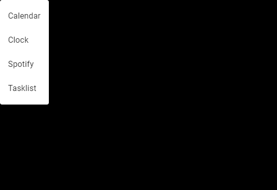
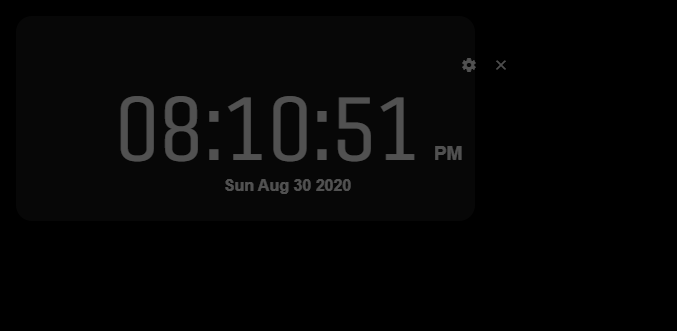

# smart-mirror
A simple smart mirror application designed to be run on a Raspberry Pi based smart mirror. It is being developed on Windows so, while care has been taken to ensure compatibility with Linux it is not guaranteed to be compatible until I can get access to a Raspberry PI.

## Basic Usage
The system is built around the idea of widgets. Small functional pieces of UI that can be moved and resized on the screen. Each widget has settings unique to the widget's type. So far there are these included widgets:

| Widget | Description |
| --- | --- |
| Clock | A simple clock that can display either a text-based clock or an analog clock face. The digital clock can show both 12 and 24 hour times. |
| Calendar | A calendar that integrates with google calendars. It offers two different modes. Summary and Monthly. Summary offers a list of the next n events, where n is a setting you can change. Monthly displays more like a classic calendar, showing the current month and the tasks on each date. This widget requires additional setup before it will work. See Google widgets |
| Tasklist | Displays a list of tasks integrated with Google Tasks. It can display the tasks from any of the user's task lists and will display their completed status. This widget requires additional setup before it will work. See Google widgets |
| Spotify Player | This widget displays the user's currently playing song on spotify as well as eventually (waiting on updates to other packages) playing songs. This requires both a premium Spotify account as well as some additional setup to get working. See Spotify widget |

### Adding and Removing Widgets
You can add widgets by moving the mouse to the top left corner of the screen and clicking the plus icon that appears. This will open a list of available widgets. Clicking one of the options will add the widget to the screen. To remove a widget just hover over the widget and click the X button that appears. Widgets are persistent across app launches so your setup will be saved if you close the application or if power is suddenly lost.

### Moving and Resizing Widgets
To move widgets on the screen you just click and hold until the widget turns slightly transparent. You can then drag the widget to wherever you want. A note: Widgets do not 'collide'. This allows for complex placements where you might want to overlay widgets.

Resizing widgets is done through the settings for a widget. To open the settings hover the mouse over the widget and click on the settings icon that appears in the top right corner. In this menu there are two fields labeled width and height. These are the size of the widgets in rows and columns of the backing grid. This grid is adaptive so it will add and remove rows and columns as the screen changes size. To change the size of the widget just type in the size you want and the widget will update live.

### Other Settings
Each widget will have their own settings unique to their type. For example the clock has a setting for 24 hour mode and the Calendar has a setting for which display style to use. These appear under the same menu as the width and height (top right corner of the widget).

## Customization
This repository is designed to be forked for personal use. To add custom widgets you can follow this guide (to be made).

### Google Widgets
A couple of the included widgets integrate with Google's APIs. In order to provide this to everyone without payment or limits, you are required to generate your own Google Cloud project and associated credentials to use these widgets. You can do so on the [Google Developer Console](https://console.cloud.google.com/apis/credentials) and selecting your project -> APIs and Auth -> Credentials. Download the `credentials.json` and place it in the project's root directory. Once this is done you can launch the software and add one of the Google widgets. A window will pop up requesting you to follow the link and enter the code from there. This allows the project to access the google APIS as you. If you are concerned about privacy / authorisation you can view the files that make use of these credentials. If you wish to revoke access from the application you can delete the credentials file and also to the applications user data path. This changes based on OS. On windows it is located in AppData (accessed by typing `%appdata%` in the top bar of File Explorer) and locating the folder with the name of the project. Deleting the corresponding `_token.json` files. e.g. `calendar_token.json`. This will mean the next time you make a request to the APIs from this software you will be prompted for access again.

### Spotify Widgets
This project offers a Spotify widget that incorporates a player into the smart mirror. It requires you have a Spotify Premium account (a requirement of spotify's APIs). At present playing songs though the smart mirror is not supported as Spotify has a requirement for content licensing. This project uses a custom fork of electron from [castlabs](https://github.com/castlabs/electron-releases#v10.0.0-wvvmp-beta.25). This provides support for Widevine EME but does not provide the necessary licenses. This is something that is being worked on by castlabs but for now playback through the smart mirror is not supported. The widget does still provide a now playing preview that displays the current song being played on your account for any device. To use this you will again, similar to Google's APIs, need to create your own project on Spotify. You can do so through the [Spotify Developer Dahsboard](https://developer.spotify.com/dashboard/) You will then need to create a `.env` file in the root of the project and add two variables:
- `VUE_APP_SPOTIFY_CLIENT_ID` This will need to be set to your project's Client ID.
- `VUE_APP_SPOTIFY_CLIENT_SECRET` This will need to be set to your project's Client Secret.

Once this is done and the application has been restarted you should be able to add the Spotify widget to the screen and it will display the currently playing track. It will update in real time.
