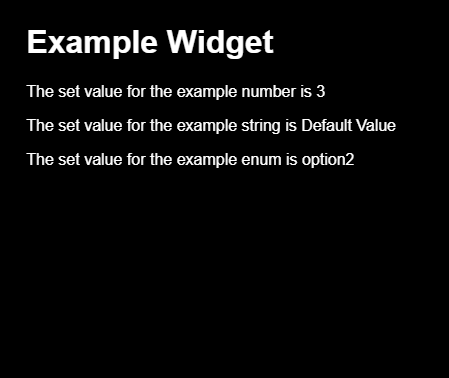
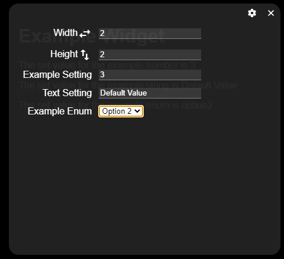

# Custom Widgets
This project allows for custom widgets to be added very simply.
The widgets consist of 2 main things. A Vue component and a settings template. Both exist within the .vue file under `src/components/widgets/<name-of-your-component>.vue`. If the file is placed here it is automatically registered with the app.

## The Component
This is just a regular Vue component, with a few requirements for proper function:
1. a prop `id` of type `String`. This serves as the main identifier of a widget and is required for retrieving widget settings.
2. Any persistent settings that must be maintained across app reloads must be stored using the below settings API. This is because the widget will be initialized by the app dynamically with only the id as a prop.

## The Settings Template
In order to facilitate persistent settings the Widget components are expected to export an extra object to specify the settings as well as other bits of metadata.
This object is expected to be exported alongside the component definition under the name `widget` (i.e. `export const widget = {...}`). This object follows the following structure:
- `widget`
  - `name`: the user visible name of the widget. This is what appears under the widget adder's menu.
  - `settings`: An object containing the definitions of the widgets various persistent settings.
    - `<setting-name>`: the key of this object is the name of a setting you can use to access the persistent value the user sets for this in the code.
      - `name`: This is the label that will be placed next to the setting's field in the settings menu of the widget.
      - `type`: One of several values. Indicates the type of the setting's variable. Can be one of `['string', 'number', 'boolean', 'enum']`. `string` will appear as a text field, `number` a number spinner, `boolean` a switch and `enum` as a dropdown menu.
      - `enumerations`: If `type` is `'enum'` then this can be set to either a string or an array. If it is an array it should contain items that follow one of the 2 structures below. If it is a string it refers to the name of the method on the widget that can be used to retrieve the available options the user can select. This should return an array that contains items that follow one of the below formats.
        - `string`: This will be used as both the value of the setting as well as what is displayed to the user.
        - `object`:
          - `value`: The value that the setting will be set to.
          - `name`: The user friendly name of the value.
      - `default`: The default value of this setting. Should be the same type as the specified type but can be different if you wish to encourage the user to select one or if a default does not make sense. If `type` is set to `enum` then this should be the same as the `value` property on the desired enumeration from `enumerations.`.
This template is not final and more types / options are soon to be implemented.

### Example Widget
```html
<template>
  <div class="example-widget">
    <h1>Example Widget</h1>
    <p>The set value for the example number is {{exampleSetting}}</p>
    <p>The set value for the example string is {{exampleTextSetting}}</p>
    <p>The set value for the example enum is {{exampleEnumSetting}}</p>
  </div>
</template>

<script>
  import {widgetSettings} from '@/widgetHelpers'
  export const widget = {
    name: "Example Widget",
    settings: {
      exampleSetting: {
        name: "Example Setting",
        type: "number",
        default: 3
      },
      exampleTextSetting: {
        name: "Text Setting",
        type: "string",
        default: "Default Value"
      },
      exampleEnumSetting: {
        name: "Example Enum",
        type: "enum",
        default: 'Option 1',
        enumerations: ['Option 1', {name: 'Option 2', value: 'option2'}]
      }
    }
  }

  export default {
    name: "ExampleWidget",
    props: {
      id: String
    },
    computed: {
      ...widgetSettings(Object.keys(widget.settings))
    }
  }
</script>

<style scoped>
  .example-widget {
    width: 100%;
    height: 100%;
    margin: 0;
    padding: 1rem;
  }
</style>
```

This example would render like so:


